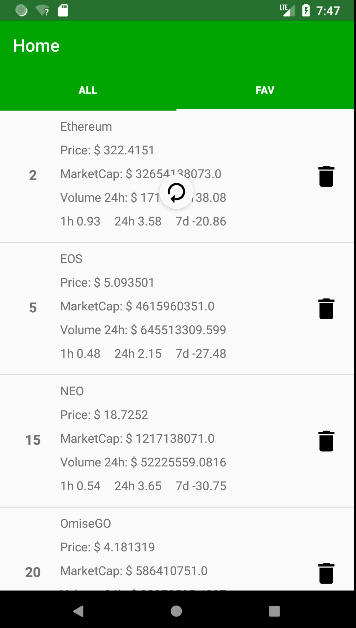
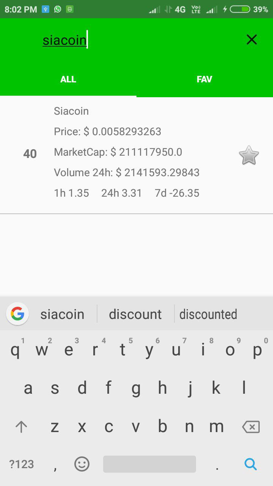
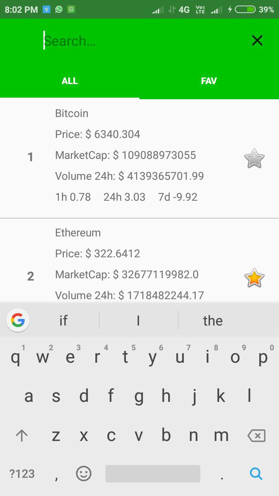
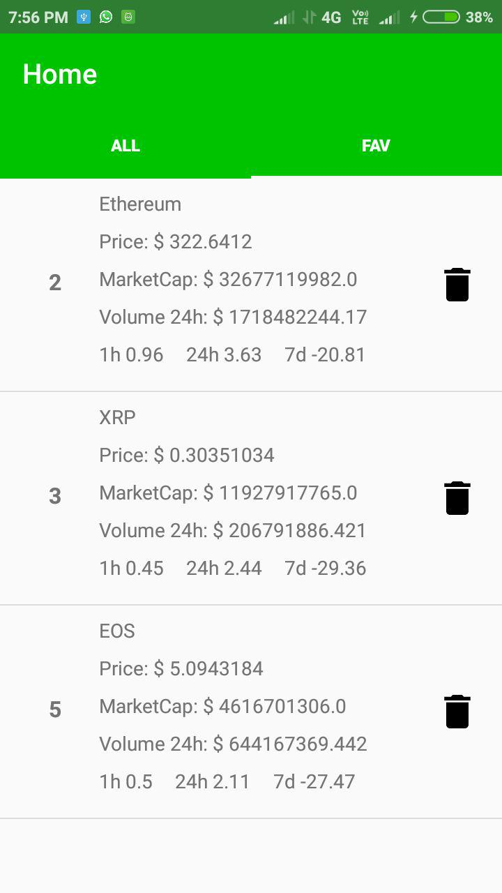
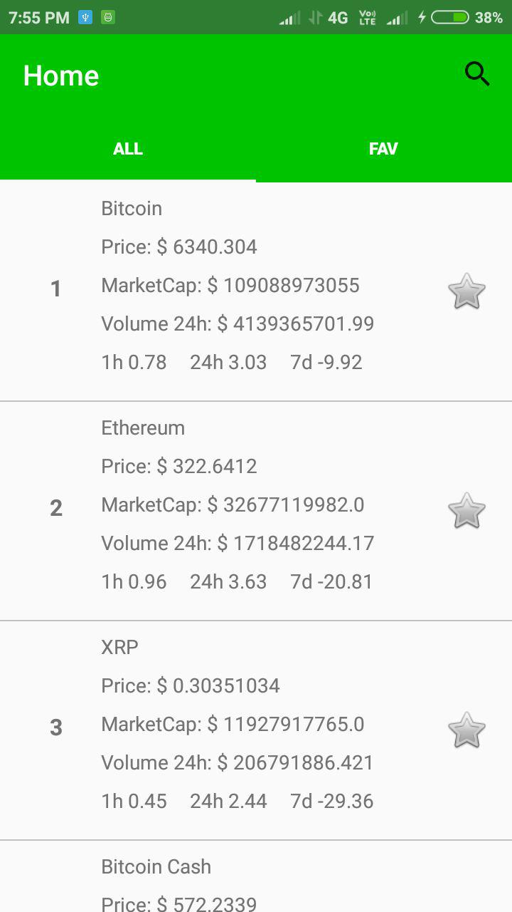

# crypto_price_track

Overview
============
This is the full code for 'crypto_price_track'.In this code we use Coinmarketcap V1 api to retrive prices of cryptocurrencies.

  

## Video
<iframe width="560" height="315" src="https://www.youtube.com/embed/i2D-BFastmw" frameborder="0" allow="autoplay; encrypted-media" allowfullscreen></iframe>
